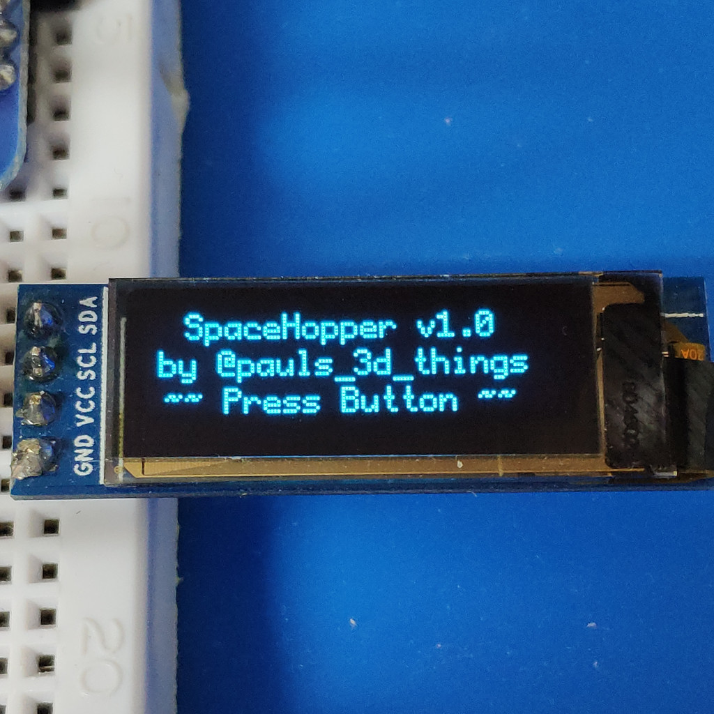
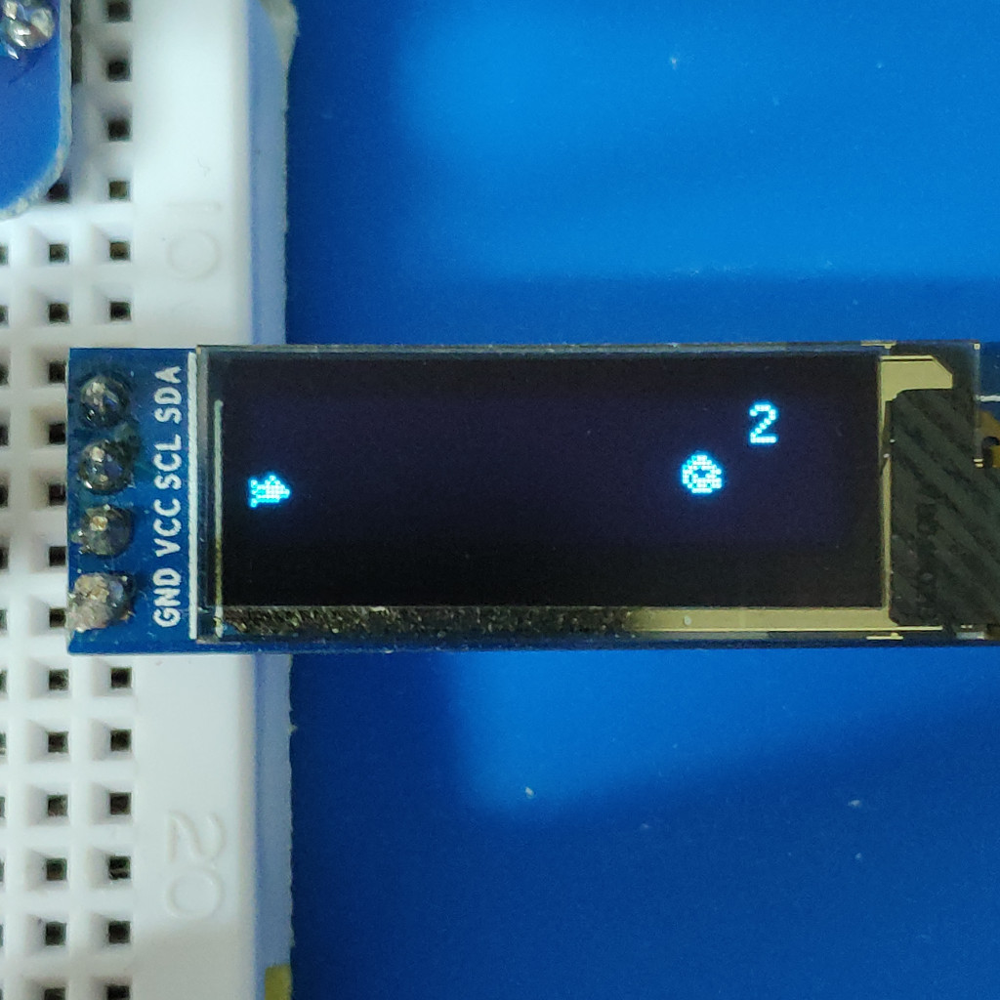
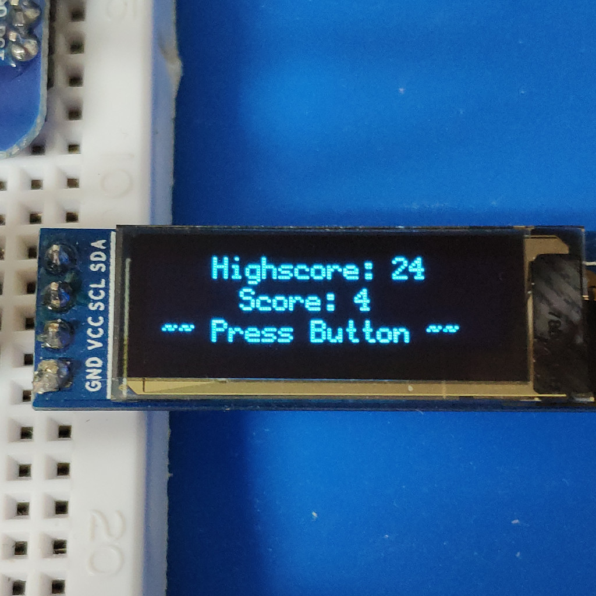

# Tiny Space Hopper game.

This is one of my side projects.

Follow me on Instagram for more: [https://instagram.com/pauls_3d_things](https://instagram.com/pauls_3d_things)

Some Screenshots:

## How To:

To build this you will need a Wemos D1mini, a Button, a 10k resistor, and an I2C OLED 128x32 screen.

Attach the button with active HIGH to D5. [Like this](https://www.arduino.cc/en/Tutorial/Button).

If you are a total noob, you can contact me via instagram or create a ticket. Otherwise I consider everyone to be smart enough to figure out the rest ;).

Have fun.